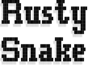
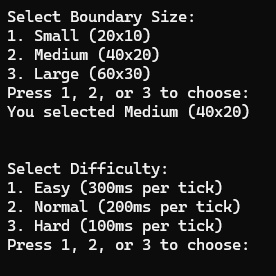
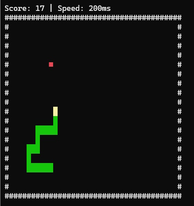
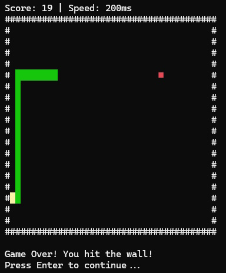

# Rusty Snake 🐍



Rusty Snake is a classic snake game built in Rust for the terminal, with a modern twist! Enjoy dynamic gameplay with customizable settings and real-time controls.

---

## Features

- **Terminal-based Gameplay:** Experience classic snake action rendered using [`crossterm`](https://github.com/crossterm-rs/crossterm) and randomized food generation via [`rand`](https://github.com/rust-random/rand).
- **Customizable Settings:**
  - **Boundary Sizes:** Choose from Small (20x10), Medium (40x20), or Large (60x30).
  - **Difficulties:** Adjust the game speed with:
    - **Easy:** 300ms per tick
    - **Normal:** 200ms per tick
    - **Hard:** 100ms per tick
- **Dynamic Gameplay Elements:**
  - **Splash Screen:** Enjoy an ASCII art splash screen at the start.
  - **Real-time Controls:** Use arrow keys to steer your snake, spacebar to pause/resume, `+` and `-` to adjust speed, and `q` to quit.
  - **Dynamic Scoring:** Eat the red food (`■`) to grow and increase your score, but avoid hitting the walls (`#`) or your own tail.

---

## Installation

### Precompiled Binaries

1. Download the latest release for your operating system from the [Releases](https://github.com/your-repo-name/releases) page.
2. Extract the archive and run the executable:
   - **Windows:** Run `rusty_snake.exe`.
   - **Linux/macOS:** Open a terminal and run `./rusty_snake`.

### Build from Source

1. Install [Rust](https://www.rust-lang.org/tools/install).
2. Clone the repository:
   ```sh
   git clone https://github.com/your-repo-name.git
   cd rusty_snake
   ```
3. Build the game:
   ```bash
   cargo build --release
   ```
4. Run the game:
   ```bash
   ./target/release/rusty_snake
   ```

---

## Controls

| Key           | Action                         |
|---------------|--------------------------------|
| `Arrow Keys`  | Move the snake                 |
| `+`           | Increase game speed            |
| `-`           | Decrease game speed            |
| `Spacebar`    | Pause/Resume the game          |
| `q`           | Quit the game                  |

---

## Gameplay

1. Select the **boundary size** and **difficulty** from the menu.
2. Use arrow keys to move the snake.
3. Eat the red food (`■`) to grow your snake and increase your score.
4. Avoid hitting the walls (`#`) or yourself!

---

## Screenshots







## License

This project is licensed under the [MIT License](LICENSE). Feel free to use, modify, and distribute the game.

---

## Contributing

Contributions are welcome! If you have ideas for improvements or find any bugs, feel free to open an issue or submit a pull request.

---

## Author

Created with ❤️ by [Amit Bahree](https://github.com/bahree) and an LLM.
